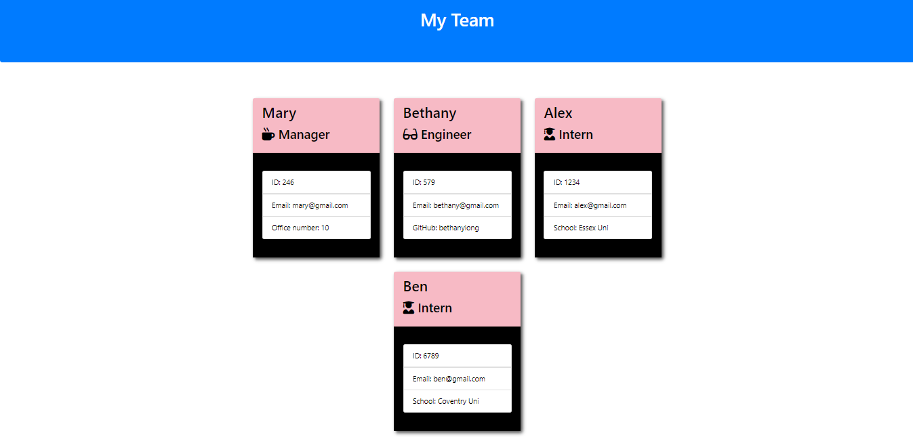

# Team-Profile-Generator

## 📌 Description
The Team Profile Generator is a command-line application that allows users to generate an HTML webpage displaying summaries of team members in a software engineering team. By answering a series of prompts, users can input information about employees, which will then be compiled into a structured team profile page.

## 🛠 Prerequisites
Before using this application, ensure you have the following installed:
* Node.js
* npm (Node Package Manager)

## 📋 Criteria
* Collects and displays information about team members.
* Generates a responsive HTML webpage with profile cards for each team member.
* Includes details such as name, role, email, GitHub, school, and office number (where applicable).
* Provides a user-friendly interface for adding and managing team members.

Classes & Structure
The application is structured around four key classes: Employee, Manager, Engineer, and Intern. These classes define properties and methods for handling team member information.

Employee (Parent Class)
* Properties: name, id, email
Methods:
* getName()
* getId()
* getEmail()
* getRole() – returns 'Employee'

Manager (Extends Employee)
* Additional Property: officeNumber
* Overridden Method: getRole() – returns 'Manager'

Engineer (Extends Employee)
* Additional Property: github (GitHub username)
* Additional Method: getGithub()
* Overridden Method: getRole() – returns 'Engineer'

Intern (Extends Employee)
* Additional Property: school
* Additional Method: getSchool()
* Overridden Method: getRole() – returns 'Intern'

All unit tests for these classes (located in the _tests_ directory) pass successfully.

## 💻 Technologies Used
Built with:
* HTML
* CSS
* Bootstrap
* JavaScript
* Node.js

Additionally, the application utilizes:

Jest for unit testing.
Inquirer for user input collection.

## 🚀 Installation
No installation required. Simply clone the repository and run the application using Node.js.

## 📚 Usage
1. Open a terminal and navigate to the project directory.
2. Run the application using the following command:
node index.js
3. Follow the prompts to enter details for each team member.
4. Once completed, the application will generate an HTML file (team.html) inside the output directory.
5. Open the generated team.html file in a browser to view the team profile.

## 🔗 Repository
Application can be viewed here:
* [Repository](https://github.com/yvonnesarah/Team-Profile-Generator)

## 🖼 Screenshot
Team Profile Preview

## 👥 Credit
N/A

## 📜 License
This project is open-source. For licensing details, please refer to the LICENSE file in the repository.

## 📬 Contact
You can reach me at 📧 yvonneadedeji.sarah@gmail.com.
